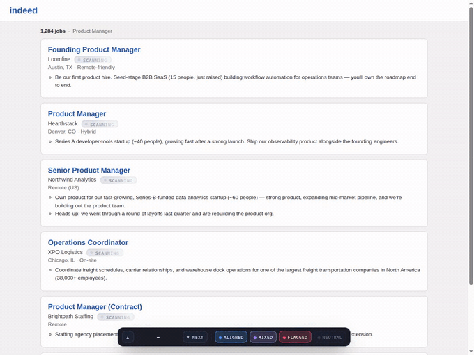
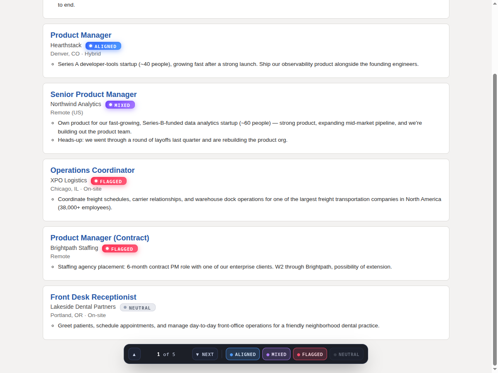
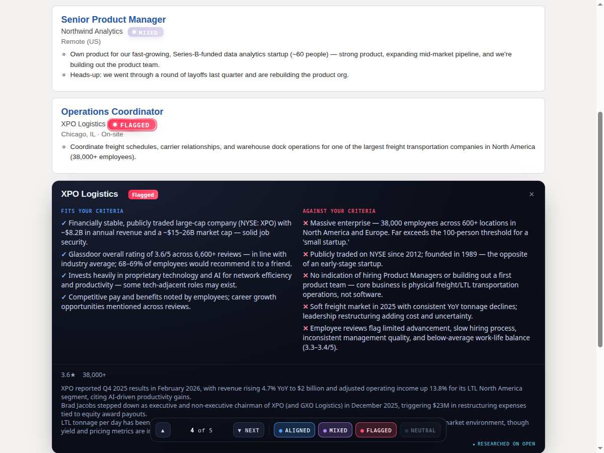
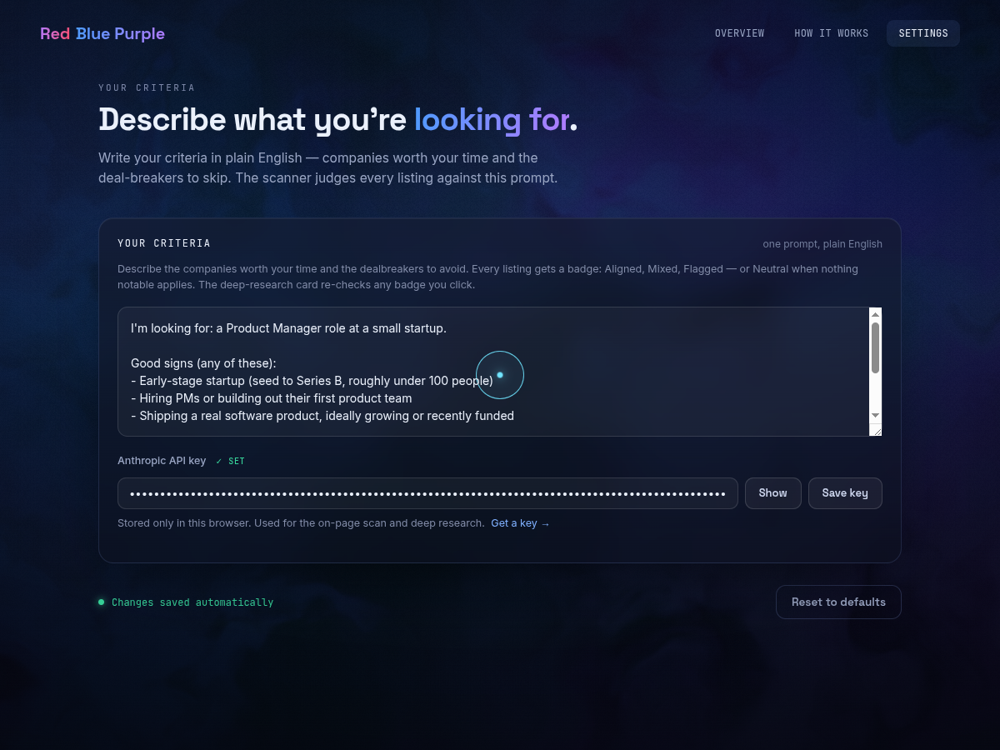

# Red Blue Purple

*Judge every company on a job board against one prompt you write — right on the page, as you browse.*

[](LICENSE)


---



## How it works

You write one prompt describing what you're looking for — the kind of company worth your time and the dealbreakers to skip. Red Blue Purple reads it once and judges every listing on the page against it. Every verdict comes from the model; the extension never computes one itself.

- 🔵 **Aligned** — matches your criteria
- 🟣 **Mixed** — some fit, some friction
- 🔴 **Flagged** — hits a dealbreaker
- ⚪ **Neutral** — your criteria don't say anything about this one

Hover any badge for the one-line reason behind it.

**Tier 1 — instant scan.** As the page loads, listings are batched and streamed to `claude-haiku-4-5`, which judges each one against your prompt and starts badging results in seconds.

**Tier 2 — click to research.** Click a badge you want to check further and `claude-sonnet-4-6` runs a live web search — company reviews, size, recent news — and can re-color the badge based on what it finds. A failed research call never re-colors a badge; you either get a better answer or the badge stays put.



A floating navigator lets you step through results with **Prev/Next** or the keyboard (**j**/**k** or arrow keys), filter by verdict, and press **Escape** to clear focus. Neutral is filtered out by default so the signal isn't buried.



Works on **indeed.com** and **glassdoor.com**.

## Install

```bash
git clone https://github.com/itsredbluepurple/RedBluePurple.git
cd RedBluePurple
npm install
npm run build            # Chrome / MV3 → .output/chrome-mv3
npm run build:firefox    # Firefox / MV2 → .output/firefox-mv2
```

Load it unpacked:

- **Chrome** — `chrome://extensions` → Developer mode → Load unpacked → `.output/chrome-mv3`
- **Firefox** — `about:debugging#/runtime/this-firefox` → Load Temporary Add-on → any file in `.output/firefox-mv2`

## Setup

Open the extension's options page and fill in two things: your criteria, in plain English, and your Anthropic API key.



> e.g. *Mid-size or larger B2B software companies, ideally growing or recently funded. Avoid: staffing agencies, companies with recent layoffs, or a reputation for bad work-life balance.*

No key or no prompt means zero badges and a nudge to finish setup — never a fabricated verdict.

### Writing a prompt that scans well

Any plain-English description works, but the verdicts key off two things: what a **fit** looks like, and your explicitly **stated dealbreakers** (mixed = fit that trips one, flagged = trips one without the fit, neutral = your criteria simply don't apply). This fill-in template makes both explicit:

```text
I'm looking for: [role] at [type of company].

Good signs (any of these):
- [industry / product type]
- [stage or size]
- [growth, funding, or other momentum signals]

Dealbreakers (flag these):
- [dealbreaker 1]
- [dealbreaker 2]
- [dealbreaker 3]
```

Filled in — say, for a product manager targeting small startups:

```text
I'm looking for: a Product Manager role at a small startup.

Good signs (any of these):
- Early-stage startup (seed to Series B, roughly under 100 people)
- Hiring PMs or building out their first product team
- Shipping a real software product, ideally growing or recently funded

Dealbreakers (flag these):
- Large companies (500+ people) or big public enterprises
- Recent layoffs or hiring freezes
- Staffing agencies or consultancies hiring for someone else
```

Keep it under a dozen lines: the prompt travels with every scan batch, and short, concrete bullets judge more consistently than paragraphs. Changing the prompt invalidates the verdict cache, so new criteria always mean fresh judgements.

## Privacy

- Your API key is stored in the extension's local storage, on your machine. It is never sent anywhere but `api.anthropic.com` (direct browser calls via `anthropic-dangerous-direct-browser-access`).
- The listing text of the page you're viewing is sent to Anthropic so it can be judged against your prompt.
- Nothing else leaves the browser. No backend, no analytics, no tracking.

## Architecture

```
entrypoints/    background service worker, content script, options/popup UI
lib/            Anthropic client, scanners, cache, storage, verdict logic
components/     badge, navigator, deep-research card
```

- **Streaming batch scan.** Listings are chunked and streamed through Haiku so badges appear as results arrive instead of waiting on the whole page.
- **Per-chunk degradation.** A failed batch drops only the listings in that chunk — the rest of the page still gets judged. Retries use exponential backoff with jitter on 429/5xx and on stream stalls; a stuck stream is detected and failed loud rather than hanging.
- **Verdict cache.** Verdicts are cached in `browser.storage.local`, keyed by a hash of your prompt, with a 24-hour TTL and a 500-entry cap. Paging through results doesn't re-spend tokens; changing your prompt invalidates the cache.
- **Fail-loud, never fabricate.** Any unrecoverable error — no key, no prompt, an exhausted retry — surfaces in-page instead of guessing at a verdict.

## Development

```bash
npm test         # vitest — 85 tests
npm run typecheck
npm run build
npm run e2e       # live demo against the real API; needs an Anthropic key in ./.key (never committed)
```

CI runs typecheck, test, and both builds on every push via GitHub Actions. Mock scanners under `lib/scanner/mock.ts` and `lib/deep/mock.ts` are test doubles only — they never ship in a build.

## License

MIT — see [LICENSE](LICENSE).
